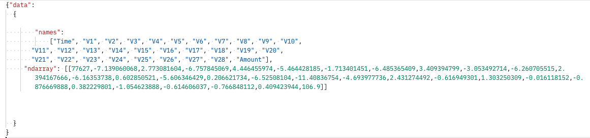

# Red Hat OpenShift Data Science Workshop - FSI Credit Fraud Detection

## Introduction

Welcome!

In this introductory workshop, you'll learn how to use **Red Hat OpenShift Data Science** or **Red Hat OpenShift Data Hub** to do Credit Fraud Detection.

* We'll start from a data like this:

* Then we'll automatically produce the semantic image segmentation results like this image:

And all of this without having to install anything on your own computer, thanks to **Red Hat OpenShift Data Science**\ **Red Hat OpenShift Data Hub**!

If you're ready,  [let's start!](step1.md)

## Navigation

<!-- startnav -->
* [Red Hat OpenShift Data Science Workshop - FSI Credit Fraud Detection](index.md)**<-- you are here**
* [Step 1: Starting a Jupyter environment](step1.md)
* [Step 2: The Jupyter environment](step2.md)
* [Step 3: Notebooks](step3.md)
* [Step 4: FSI Credit Fraud Detection](step4.md)
* [Conclusion](step8.md)
<!-- endnav -->
