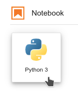

[Back to the previous section](step2.md)

# Step 3: Notebooks

This section provides a small introduction on how to use Jupyter Notebooks. If you're already at ease with Jupyter, you can [directly head to the next section](step4.md).

## What's a notebook?

* A notebook is an environment where you have *cells* that can display formatted text, or code.

This is an empty cell:
{:refdef: style="text-align: center;"}

{: refdef}

And a cell where we have entered some code:
{:refdef: style="text-align: center;"}

{: refdef}

* Code cells contain Python code that can be run interactively. Thats means you can modify the code, then run it. The code will not run on you computer or in the browser, but directly in the environment you are connected to, **Red Hat OpenShift Data Science** in our case.

* To run a code cell, just select it (click in the cell, or on the left side of it), and click the Run/Play button from the toolbar (you can also press CTRL+Enter to run a cell, or Shift+Enter to run the cell and automatically select the following one).

The Run button on the toolbar:

{:refdef: style="text-align: center;"}

{: refdef}

Our cell after pressing Run:

{:refdef: style="text-align: center;"}

{: refdef}

As you can see, you have the result of the code that was run in that cell, as well as information on when this particular cell has been run.

* When you save a notebook, the code as well as the results are saved! So you can always reopen it to look at the results without having to run all the program again, while still having access to the code.

Notebooks are so named because they are just like a physical **Notebook**: it's exactly like if you were taking notes about your experiments (which you will do), along with the code itself, including any parameters you set. You see the output of the experiment inline (this is the result from a cell once it's run), along with all the notes you want to take (to do that, switch the cell type from the menu from `Code` to `Markup`).

## Time to play

Now that we have covered the basics, just give it a try!

* In your Jupyter environment (the file explorer-like interface), there is file called `01_sanbdbox.ipynb`. Double-click on it to launch the notebook (it will open another tab in the content section of the environment). Please feel free to experiment, run the cells, add some more and create functions. You can do what you want - it's your environment, and there is no risk of breaking anything or impacting other users. This environment isolation is also a great advantage brought by **Red Hat OpenShift Data Science**.

* You can also create a new notebook by selecting `File`->`New`->`Notebook`from the menu on the top left, then select a Python 3 kernel. This instructs Jupyter that we want to create a new notebook where the code cells will be run using a Python 3 kernel. We could have different kernels, with different languages or versions that we can run into notebooks, but that's a story for another time...

* You can also create a notebook by simply clicking on the icon in the launcher:

{:refdef: style="text-align: center;"}

{: refdef}

* If you want to learn more about notebooks, head to [this page](https://jupyter.org/){:target="_blank"} .

Now that you're more familiar with notebooks, you're ready to [go to the next section.](step4.md)

## Navigation

<!-- startnav -->
* [Red Hat OpenShift Data Science Workshop - FSI Credit Fraud Detection](index.md)
* [Step 1: Starting a Jupyter environment](step1.md)
* [Step 2: The Jupyter environment](step2.md)
* [Step 3: Notebooks](step3.md)**<-- you are here**
* [Step 4: FSI Credit Fraud Detection](step4.md)
* [Conclusion](step8.md)
<!-- endnav -->
