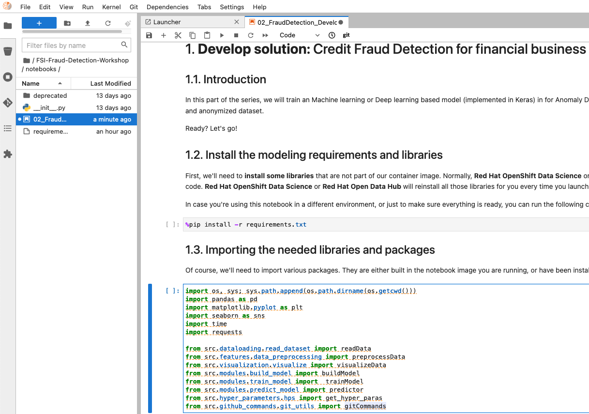
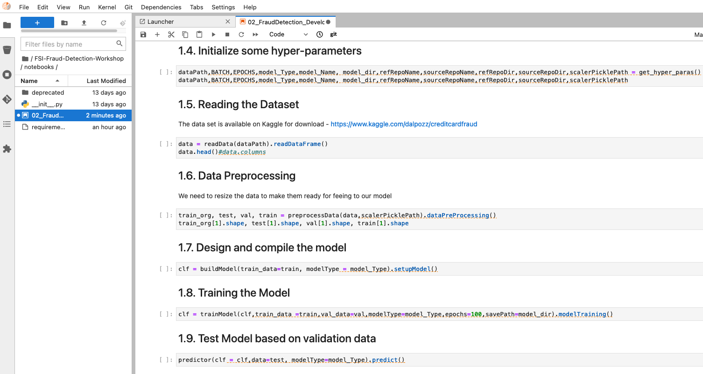
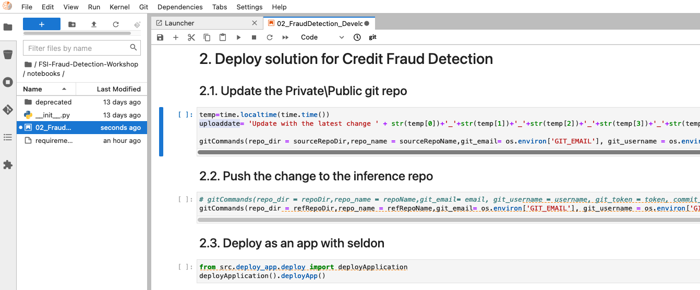
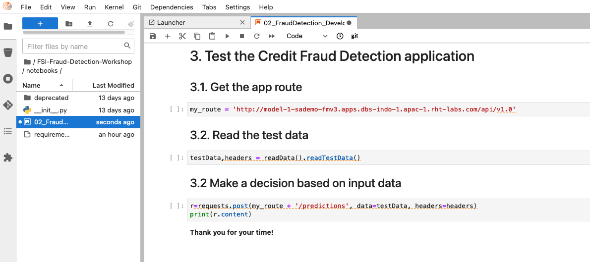
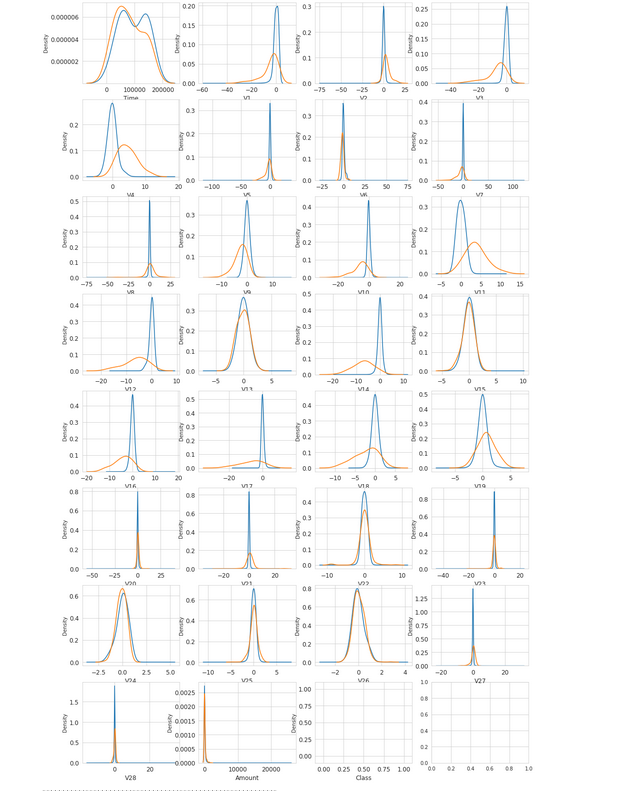
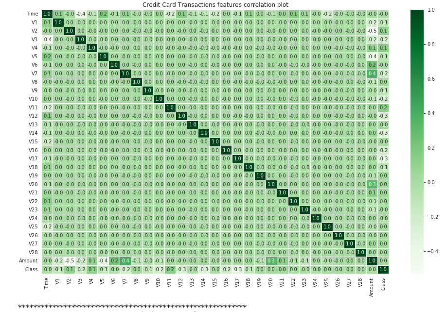
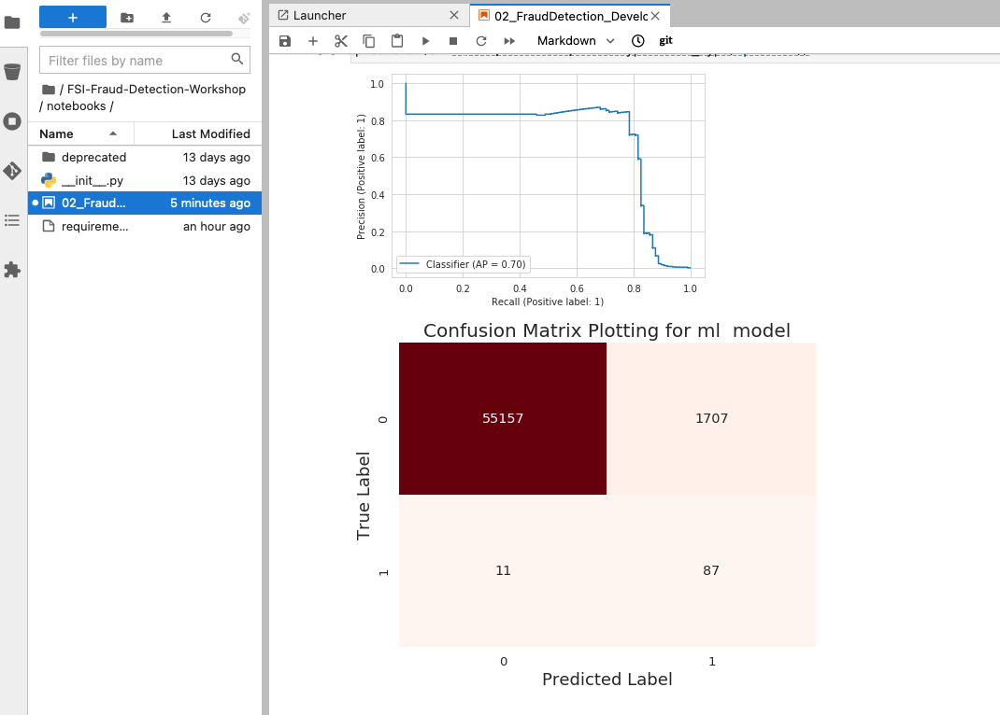
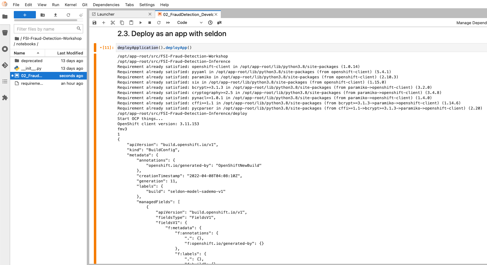
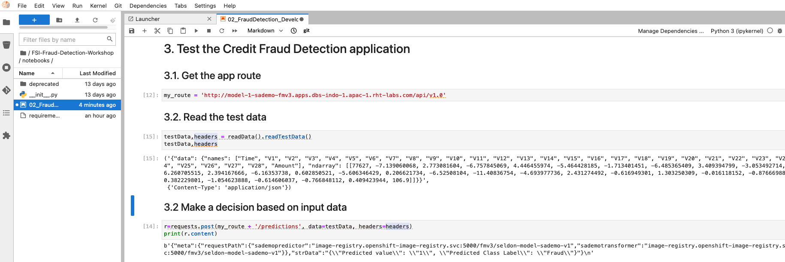

[Back to the previous section](step3.md)

# Step 4: FSI Credit Fraud Detection

Now that you know how the environment works, the real work can begin!

Please go to the notebook folder, then  just open the file `02_FSI-Fraud-Detection-Workshop.ipynb`, and follow the instructions directly in the notebook!

This one stop notebook covers all steps of a data science modeling! From developing the AI/ML solution, to deploying the solution via containers and then testing the application! 

{:refdef: style="text-align: center;"}

{: refdef}
{:refdef: style="text-align: center;"}

{: refdef}
{:refdef: style="text-align: center;"}

{: refdef}
{:refdef: style="text-align: center;"}

{: refdef}

Please Run the notebook!

This notebook starts with presenting some head of the data, then plot the distribution and correlation among various features.

{:refdef: style="text-align: center;"}

{: refdef}
{:refdef: style="text-align: center;"}

{: refdef}

After that, it defines the model and train and test it via validation data!

{:refdef: style="text-align: center;"}

{: refdef}

At the end of the training/testing, it will start to deploy the model:

{:refdef: style="text-align: center;"}

{: refdef}

Finally, at the end of this notebook, it tests the application via passing the new data! 

{:refdef: style="text-align: center;"}

{: refdef}

## Navigation

<!-- startnav -->
* [Red Hat OpenShift Data Science Workshop - FSI Credit Fraud Detection](index.md)
* [Step 1: Starting a Jupyter environment](step1.md)
* [Step 2: The Jupyter environment](step2.md)
* [Step 3: Notebooks](step3.md)
* [Step 4: FSI Credit Fraud Detection](step4.md)**<-- you are here**
* [Conclusion](step5.md)
<!-- endnav -->
